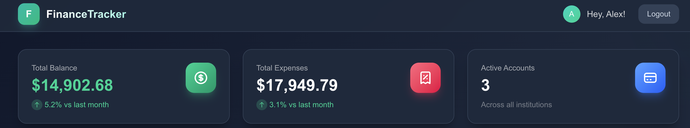

# FinanceTracker

A full-stack personal finance management application with AI-powered budgeting assistance.

**[Live Demo](https://finance-tracker-app-ivory.vercel.app)** | **Demo Login:** `demo@financetracker.dev` / `Demo123!`



## Features

- **Expense Tracking** - Log and categorize daily expenses with detailed breakdowns
- **Account Management** - Track balances across checking, savings, and credit accounts
- **Analytics Dashboard** - Visualize spending patterns with interactive charts
- **AI Budget Assistant** - Get personalized financial advice powered by Claude AI
- **Secure Authentication** - JWT-based auth with HTTP-only cookies

## Tech Stack

### Backend
- **.NET 8** - Web API with clean architecture
- **Entity Framework Core** - ORM with PostgreSQL
- **FluentValidation** - Request validation
- **JWT Authentication** - Secure token-based auth
- **Rate Limiting** - Protection against abuse

### Frontend
- **Next.js 16** - React framework with App Router
- **TypeScript** - Type-safe development
- **TanStack Query** - Server state management
- **Recharts** - Data visualization
- **Tailwind CSS** - Utility-first styling

### Infrastructure
- **PostgreSQL** - Primary database (Supabase)
- **Render** - Backend hosting
- **Vercel** - Frontend hosting
- **Claude API** - AI assistant integration

## Architecture


### Key Design Decisions

- **Soft Delete Pattern** - Preserves data integrity for analytics and audit trails
- **Global Query Filters** - Automatically excludes deleted records from queries
- **Cross-Origin Cookie Auth** - Secure authentication across Vercel/Render domains
- **Rate Limiting Policies** - Different limits for auth (5/min), API (100/min), and AI (10/min) endpoints

## Getting Started

### Prerequisites
- .NET 8 SDK
- Node.js 18+
- PostgreSQL (or use Supabase)

### Backend Setup

```bash
cd backend/FinanceTrackerAPI

# Configure user secrets
dotnet user-secrets set "ConnectionStrings:DefaultConnection" "your-postgres-connection-string"
dotnet user-secrets set "Jwt:SecretKey" "your-secret-key-min-32-chars"
dotnet user-secrets set "Claude:ApiKey" "sk-ant-your-key"

# Run migrations
dotnet ef database update

# Start the server
dotnet run
```

### Frontend Setup

```bash
cd frontend/financetrackerapp

# Install dependencies
npm install

# Configure environment
echo "NEXT_PUBLIC_API_URL=http://localhost:5280" > .env.local

# Start development server
npm run dev
```

## API Endpoints

| Endpoint | Method | Description |
|----------|--------|-------------|
| `/api/v1/Auth/login` | POST | User authentication |
| `/api/v1/Auth/logout` | POST | Clear session |
| `/api/User/create` | POST | Register new user |
| `/api/User/me` | GET | Current user profile |
| `/api/Expense` | GET/POST | Expense management |
| `/api/Account` | GET/POST | Account management |
| `/api/Analytics/summary` | GET | Financial analytics |
| `/api/BudgetAssistant/chat` | POST | AI assistant |

## Project Structure

```
finance-tracker-app/
├── backend/
│   └── FinanceTrackerAPI/
│       ├── FinanceTracker.API/        # Controllers, Middleware
│       ├── FinanceTracker.Data/       # DbContext, Migrations
│       ├── FinanceTracker.Domain/     # Entities, Interfaces
│       └── Services/                  # Business logic, DTOs
├── frontend/
│   └── financetrackerapp/
│       └── src/app/
│           ├── components/            # Reusable UI components
│           ├── hooks/                 # Custom React hooks
│           ├── lib/                   # Utilities, API client
│           └── (pages)/               # Route pages
└── docs/
    └── images/                        # Screenshots, diagrams
```

## Security Features

- **Password Hashing** - BCrypt with salt
- **JWT in HTTP-only Cookies** - XSS protection
- **CORS Restrictions** - Whitelist allowed origins
- **Rate Limiting** - Brute-force protection
- **Input Validation** - FluentValidation on all endpoints
- **Soft Delete** - Data preservation for audits

## Future Roadmap

- [ ] Savings goals tracking
- [ ] Family budgeting features
- [ ] Emotional spending analysis
- [ ] Export to CSV/PDF
- [ ] Recurring transactions
- [ ] Mobile app (React Native)

## License

MIT

---

Built as a portfolio project demonstrating full-stack development with .NET and React.
